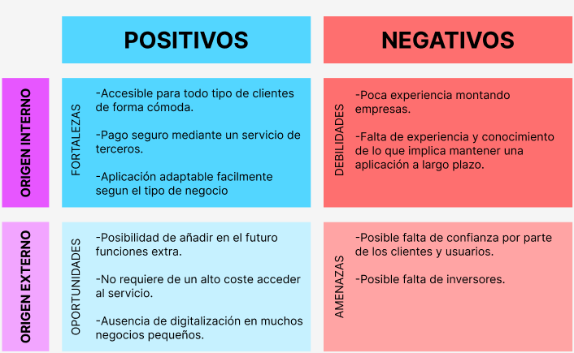
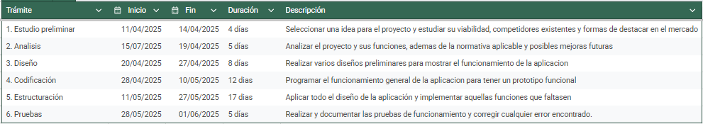
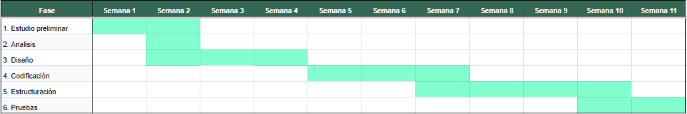

# Anteproxecto fin de ciclo

- [Anteproxecto fin de ciclo](#anteproxecto-fin-de-ciclo)
  - [1- Descrición do proxecto](#1--descrición-do-proxecto)
  - [2- Empresa](#2--empresa)
    - [2.1- Idea de negocio](#21--idea-de-negocio)
    - [2.2- Xustificación da idea](#22--xustificación-da-idea)
    - [2.3- Segmento de clientes](#23--segmento-de-clientes)
    - [2.4- Competencia](#24--competencia)
    - [2.5- Proposta de valor](#25--proposta-de-valor)
    - [2.6- Forma xurídica](#26--forma-xurídica)
    - [2.7- Investimentos](#27--investimentos)
      - [2.7.1- Custos](#271--custos)
      - [2.7.2- Ingresos](#272--ingresos)
    - [2.8- Viabilidade](#28--viabilidade)
      - [2.8.1- Viabilidade técnica](#281--viabilidade-técnica)
      - [2.8.2 - Viabilidade económica](#282---viabilidade-económica)
      - [2.8.3- Conclusión](#283--conclusión)
  - [3- Requirimentos técnicos](#3--requirimentos-técnicos)
  - [4- Planificación](#4--planificación)

## 1- Descrición do proxecto

Este proyecto consiste en una plataforma web mediante la cual gestionar las citas y reservas de pequeños negocios locales.

Los usuarios pueden crear una cuenta y reservar cita desde ahi, pudiendo gestionarlas, reprogramarlas, recibir notificaciones respecto a su cita,...

Se mostrará una lista de los servicios que ofrece la empresa para que el usuario seleccione cual o cuales desea y además incluya cualquier informacion adicional.

Por parte de la empresa, esta puede consultar las citas que se han reservado y gestionarlas.

Para la realizacion del proyecto se combinaran varias tecnologias, como por ejemplo html, css, javascript y php, además de una base de datos relacional.

## 2- Empresa

### 2.1- Idea de negocio

El producto central es una aplicación web para la gestión de citas y reservas de pequeños negocios, como peluquerías, dentistas,... 

Con esto, se busca facilitar a los clientes el proceso de reservar y gestionar sus citas y a la empresa el proceso de consultar las citas y modificarlas de surgir cualquier percance

El valor añadido de esta idea se basa en que simplifica el proceso de reserva, ahorrando fases como tener que comprobar cuando hay hueco para agendar la cita o tener que llamar para modificarla. 
Además, tambien muestra la lista de servicios disponibles junto a su duración estimada, dandole al cliente una idea de cuanto tardará para que asi pueda seleccionar el horario que le venga mejor.

Como productos adicionales se incluyen el empleo de una aplicación externa de pago para mayor seguridad en caso de que la reserva para un negocio en concreto requiriera del mismo.

Además, la aplicación incluirá una landing page para presentar el servicio, su funcionamiento y su utilidad de forma clara, atrayendo así a posibles interesados.

### 2.2- Xustificación da idea

Esta idea surge ante la creciente necesidad de digitalizarse en el mercado actual, donde gran parte de los negocios ya operan de forma online. Esto puede resultar problemático para aquellas empresas mas pequeñas, que al contar con menos recursos prefieren seguir gestionando de forma más tradicional sus reservas, quedando desfasadas en ese sentido y invirtiendo más tiempo del que invertirian de estar digitalizadas.

Además, una gestion manual de las citas y reservas es mas propensa a generar errores, como por ejemplo que las citas se amontonen, lo que provoca retrasos y una mala experiencia para el cliente

Segun el informe Cifras PYME de 2023 existen casi 3 millones de PYME en España, de las cuales más de 1 millon y medio son PYME sin asalariados y más de un millón son microempresas. Aparte, segun el INE, solo el 33% de las empresas españolas con menos de 10 empleados contaban con pagina web a inicios de 2024.

Así pues, queda patente que pese a que las empresas más pequeñas constituyen una gran parte de la cantidad total de empresas del pais, la mayoria apenas estan empezando a digitalizarse. Para ayudar en este proceso, se busca establecer una plataforma que permita realizar la gestión de las reservas de una forma comoda y sencilla, ayudandolas a adaptar al mercado digital.

Actualmente existe plataformas similares a esta, como Fresha o Timify, que tambien permiten realizar la gestion de las reservas de forma online. No obstante, estas plataformas suelen abarcar un sector específico o estar mas enfocadas a empresas más grandes, teniendo una curva de aprendizaje mas elevada y ofertando planes con características que pueden resultar innecesarias para empresas más pequeñas. 

Otras alternativas existentes son aplicaciones como Calendar o WhatsApp, pero a diferencia de ellas la aplicación no solo ofrece la gestión de las citas en si, si no también la gestión de los horarios de apertura y servicios ofertados, asi como la automatización de las notificaciones al momento de editar o cancelar una cita.

Esta aplicación busca adaptarse a las características de cada negocio en particular, creando un servicio intuitivo y personalizado acorde a sus necesidades. Así, se atiende ese segmento del mercado compuesto por aquellas empresas más pequeñas que aun no se han adaptado del todo a las nuevas tecnologias y podrían ahorrar tiempo y recursos si lo hicieran.

Para lograr esto, la aplicación será elaborada de forma reutilizable, es decir, pese a que estará personalizada para cada cliente cada implementación partirá de una base común, ahorrando bastante tiempo de desarrollo. Solamente supondría mayores costes de tiempo en el caso de que una empresa solicite alguna función específica que no se haya desarrollado antes, pero este supuesto ya se contempla al ofrecer planes adaptados donde el precio final dependerá de las funciones solicitadas.

Pese a no ser un producto completamente nuevo, es cierto que existe una necesidad real de adaptarse al actual mercado digital, siendo un proceso que las compañias mas grandes pueden permitirse al contar con mayores recursos pero que en el caso de las mas pequeñas implica un alto coste que muchas veces los deja desfasados. A todo esto se suma la necesidad de que la aplicación sea entendible por cualquier cliente y usuario independientemente de sus conocimientos tecnológicos.

#### DAFO

### 2.3- Segmento de clientes

Este negocio diferencia entre usuarios y clientes:

> - Por parte de los clientes va dirigido fundamentalmente a aquellos pequeños negocios (peluquerias de barrio, clinicas dentales, talleres, etc.) que aun no se han digitalizado. 

En concreto va dirigido a las microempresas, las cuales en su mayoria siguen gestionando las citas mediante teléfono o mensaje y ni siquiera cuentan con pagina web, ofreciendoles una alternativa económica y sencilla que les permita automatizar este proceso.

> - Por parte de los usuarios va dirigido a cualquier persona que haga uso de los servicios del negocio que contrate la aplicación, buscando ofrecerles una forma de gestionar las citas facil e intuitiva. 

Si bien se busca atraer a cualquier tipo de usuarios, la aplicación esta orientada a satisfacer las necesidades de aquellos usuarios que buscan una experiencia rapida y directa, sin necesidad de tener que realizar llamadas o esperar a que sus mensajes sean respondidos.

### 2.4- Competencia

Actualmente ya existen empresas que ofrecen servicios similares para gestionar las citas, sobre todo enfocadas a sectores como la estética. Entre ellas encontramos:

> - Fresha: Opera en el sector de belleza y bienestar, siendo usada por mas de 120000 negocios en mas de 120 países. Obtiene ingresos mediante un modelo de suscripción a cambio de funciones adicionales.

> - Timify: Opera en varios tipos de sectores y esta avalado por más de 45000 empresas en 430 paises. Obtiene ingresos mediante una serie de planes que ofrecen cada vez más funciones por un costo mayor.

> - Simplybook: Opera en varios tipos de sectores, trabajando en más de 50000 empresas de más de 200 paises. Obtiene ingresos mediante una serie de planes que ofrecen diversas funciones, además de limitar la cantidad de reservas mensuales.

Además de estas empresas, existen otros servicios sustitutivos, como pueden ser las aplicaciones de mensajeria o la gestión mediante llamadas telefónicas.

Si bien estas plataformas estan bien posicionadas, muchas de ellas al ser tan generales pueden resultar demasiado costosas o complejas de manejar para aquellos negocios más pequeños. Además, al basarse muchas de ellas en planes fijos con unas funciones concretas, no se ajustan exactamente a lo que quiere cada negocio, por lo que muchos de ellos acaban pagando por un plan que incluye funciones que no necesitan.

### 2.5- Proposta de valor

A diferencia de los competidores, esta aplicación busca centrarse en las necesidades de cada pequeño negocio en concreto, ofreciendo solo aquellas características que realmente necesiten y ayudando a digitalizarse a aquellos negocios que aun gestionen sus citas de forma manual o poco eficiente.

Las mejoras frente a la competencia son:

> - Una interfaz lo más sencilla e intuitiva posible para que cualquier persona independientemente de sus conocimientos tecnológicos pueda manejarla.

> - Un servicio adaptado a las necesidades de cada negocio en concreto, sin incluir funciones innecesarias.

> - Accesible desde el propio navegador, sin necesidad de instalaciones adicionales.

Así, el valor que aporta al mercado es el de ahorrar el tiempo invertido a la hora de gestionar las citas de los clientes, mejorando tanto la organización de las mismas como el proceso en sí de realizar una reserva por parte del cliente. Además contribuye a fomentar la digitalización en aquellos negocios con menos recursos y que son mas rehacios a abandonar los métodos tradicionales.

Las razones para adquirir este producto frente a la competencia son que es un producto sencillo y asequible a la vez que adaptado a cada negocio. En vez de ser un servicio mas general que acepte todo tipo de empresas, este servicio se ajusta a las necesidades individuales de cada una, ofertando solo aquellas funciones que realmente necesiten y permitiendoles modernizarse sin complicaciones.

### 2.6- Forma xurídica

La forma jurídica sería autonomo, al ser un proyecto pequeño realizado de forma individual.

La razón de escoger esta forma es porque ser autónomo requiere menos tramites iniciales, siendo necesario obtener un número de afiliación a la seguridad social y darse de alta en la misma bajo el RETA (Regimen Especial de Trabajadores Autonomos), indicando a que mutua se acoge para cubrir las enfermedades profesionales y accidentes de trabajo. 
Tras esto hay que darse de alta en el censo de empresarios y cumplimentar el modelo 036. Una vez inscrito, solo queda comunicar la apertura del centro de trabajo a la consejeria de trabajo de la comunidad autonoma y solicitar las licencias necesarias para la actividad a desarrollar.

En cuanto a tributación, se tributa por medio del IRPF, cuyo porcentaje varia segun los beneficios percibidos.

En cuanto a las cuotas sociales, el coste de gestoria suele ser menor al tener una contabilidad mas sencilla que otras formas jurídicas. Ademas, se puede solicitar la tarifa plana para la cuota de la Seguridad Social, lo que permite pagar 80 euros mesuales durante el primer año de la actividad (y durante el segundo si sus ingresos netos están por debajo del SMI). Tras esto, la cuota dependerá de la base de cotización, yendo por tramos de ingresos que comprenden entre una cuota mínima de 200 a 605 euros y una máxuima de 226 a 1542 euros.

### 2.7- Investimentos

> - Equipo informático: 900 euros
> - Mobiliario: 150 euros
> - Local: el trabajo se realiza desde casa y se contabilizan los gastos en luz y electricidad

Total inversión inicial: 1050 euros

#### 2.7.1- Custos

Al utilizar el hogar como local, Hacienda permite deducir un 30% de los gastos sobre el espacio usado para la actividad laboral. AL emplearse una de las 5 habitacion se deduce el 30% del 20% del total del hogar.

Costes fijos:

> - Dominio: 9,99/año
> - Servicio de Hosting: 35,88/año
> - Luz (850/año): 850*20%= 170-170*30% = 119/año
> - Internet (360/año): 360*20%= 72-72*30% = 50,4/año
> - Publicidad: 500/año
> - Cuota autónomos (reducida el primer año a 80 euros mensuales): 960/año
> - Salario (solo trabajo yo por lo que lo establezco inferior al SMI): 11700/año

Total anual: 12375,27/año

Costes variables:

> - Comisión por reservas de la aplicación externa en caso de que la reserva implique un pago: 1,5% + 0,25

Impuestos: 

> - IRPF: segun los beneficios

#### 2.7.2- Ingresos

Política de precios:

Segun las características requiridas se puede optar por una aplicación básica de gestión o una con características adicionales adaptadas al negocio en si

> - Aplicación con las funciones básicas (plan básico): 10/mes.
> - Aplicación adaptada al negocio con funciones adicionales (plan avanzado) : 20-25/mes.

Prevision de ventas: 

Aproximadamente 20 clientes del primer plan (200/mes) y 10 del segundo (225/mes de promedio) al final del primer año. Teniendo en cuenta que los clientes que contraten los servicios del negocio el primer mes seguirán generando ingresos los meses venideros, la estimación arroja el siguiente resultado:

| Mes | Clientes básico | Clientes avanzado | Total mes |
|-----|-----------------| ------------------| --------- |
| 1   | 2               | 1                 | 42,5      |
| 2   | 4               | 2                 | 85        |
| 3   | 6               | 3                 | 127,5     |
| 4   | 8               | 3                 | 147,5     |
| 5   | 10              | 4                 | 190       |
| 6   | 11              | 5                 | 222,5     |
| 7   | 13              | 6                 | 265       |
| 8   | 15              | 7                 | 307,5     |
| 9   | 17              | 8                 | 350       |
| 10  | 17              | 8                 | 350       |
| 11  | 18              | 9                 | 382,5     |
| 12  | 20              | 10                | 425       |

Total: 2895 euros el primer año

### 2.8- Viabilidade

#### 2.8.1- Viabilidade técnica

Bajo un punto de vista técnico, el proyecto es viable. La aplicación se desarrollaría utilizando las tecnologias anteriormente mencionadas, las cuales son accesibles y faciles de emplear, sin requerir de herramientas o licencias especializadas.

Es posible disponer de los recursos humanos y medios de produccion necesarios. Solo se requiere de un equipo informático, ya presupuestado en la inversión inicial, un servicio de hosting, un dominio, electricidad y conexión a internet. Respecto a las instalaciones, se puede desenvolver desde casa, no requiere de un local para desenvolver el negocio.

No existe ningun impedimento mas alla de la posibilidad de que un cliente solicite que su aplicación tenga alguna funcionalidad a mayores que resultase ser demasiado compleja como para abarcarla en su totalidad con exactitud.

#### 2.8.2 - Viabilidade económica

Tal y como se indicó en el apartado anterior, los costes iniciales se compondrían de 1050 euros como inversión inicial y 12375,27 euros como costes fijos del primer año. A esto hay que sumarle los costes variables e impuestos como el IRPF.

Por lo tanto, el primer año se gastaria un total de más de 12425,27 euros

En cuanto a ingresos, estos supondrian aproximadamente una cantidad de 2895 euros totales a lo largo del primer año, lo que claramente da un balance negativo respecto a los gastos.

#### 2.8.3- Conclusión

En conclusión, el proyecto es viable bajo el punto de vista técnico. 

En cuanto a su viabilidad económica, si bien el primer año no llega a cubrir practicamente nada de los gastos, hay que tener en cuenta que una parte de ellos son la inversión inicial, la cual una vez cubierta ya no supondrá un gasto. 
Aun con esto, a partir del segundo año la cuota de autonomos aumentaria al dejar de usarse la tarifa plana (a no ser que se reuniesen los requisitos para poder emplearla el segundo año), lo que supondría un gasto anual de mínimo 2400 euros en vez de 960 euros. 

No obstante, debe tenerse en cuenta que en los siguientes años el negocio percibirá ingresos tanto de los nuevos clientes como de los de años anteriores, aumentandose gradualmente la cantidad de dinero generado al mes. También cabe destacar que gran parte de los costes fijos son debido al salario, el cual al ser una empresa compuesta únicamente por el propio autonomo podría ser ajustado conforme a la situación económica de la mismas. 

Por lo tanto, si bien los beneficios del proyecto no superan los costes, el deficit negativo es asumible a largo plazo, reduciendose gradualmente en los primeros años hasta lograr generar ingresos. Una vez superado esto, el bajo coste de mantener el servicio sumado a su escalabilidad lo hacen sostenible a la larga.

Además, las perdidas podrian cubrirse mediante diversas vias de financiación, como por ejemplo el programa Kit Digital o la bonificación de autónomos de Galicia. 
Todo esto depende de los requisitos de las mismas, siendo en algunos casos necesario tener antes una antiguedad y facturación minimas, por lo que si bien en un principio no cubririan los gastos al momento si que los cubrirían en el futuro.

## 3- Requirimentos técnicos

### Infraestructura

Para realizar la aplicación será necesario contar con una infraestructura compuesta por:

- Un **servidor de bases de datos** que almacene la informacion referente a los usuarios sus reservas.
- Un **dominio** para acceder facilmente a la aplicación. 
- Un **servidor web dedicado** donde alojar la aplicacion web para su puesta en producción. Será necesario que incluya soporte para PHP y MariaDB y la posibilidad de crear copias de seguridad automáticas y un certificado SSL para realizar conexiones HTTPS. Además debería tener entre 1-2 CPU virtuales, unos 4GB de RAM y almacenamiento SSD de mínimo 10GB, para de ese modo garantizar el correcto funcionamiento de la aplicación.

### Backend

En el desarrollo del Backend se se utilizará **PHP** junto a la base de datos relacional MariaDB.

### Frontend

En cuanto a Frontend se utilizará fundamentalmente **HTML**, **CSS** y **JavaScript**

## 4- Planificación

[Ver documento en Google Drive](https://docs.google.com/spreadsheets/d/1kpykDfHXtSo1yaPI2eACs158QWQv665RncFkcX2uEAA/edit?usp=sharing)

[**<-Anterior**](../../README.md)
