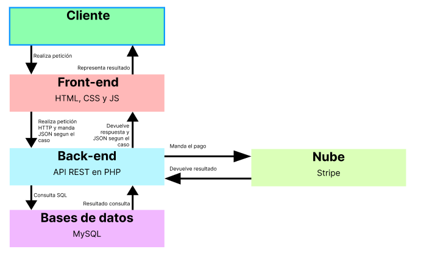
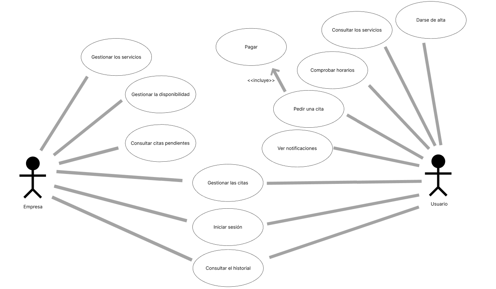
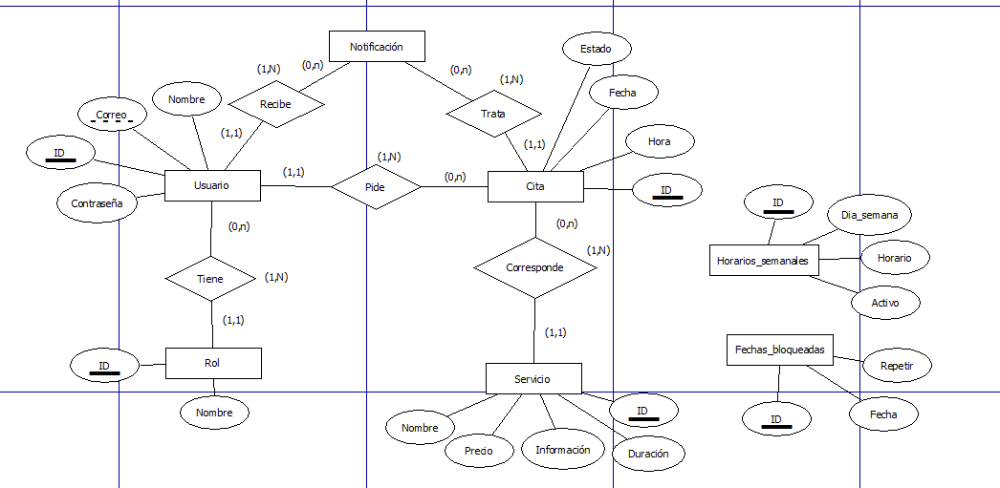
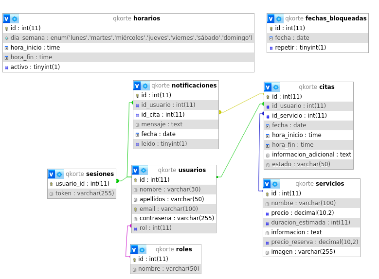

# FASE DE DESEÑO

- [FASE DE DESEÑO](#fase-de-deseño)
  - [1- Diagrama da arquitectura](#1--diagrama-da-arquitectura)
  - [2- Casos de uso](#2--casos-de-uso)
  - [3- Diagrama de Base de Datos](#3--diagrama-de-base-de-datos)
  - [4- Deseño de interface de usuarios](#4--deseño-de-interface-de-usuarios)

## 1- Diagrama da arquitectura

## 2- Casos de uso

## 3- Diagrama de Base de Datos

### 3.1- Modelo Entidad/Relación

### 3.2- Modelo Relacional.

## 4- Deseño de interface de usuarios

🔗 [Ver Figma](https://www.figma.com/design/kikFpU4xkhWabWEbbvvzY4/ProyectoDAW?node-id=2-2&t=e9g2RXawkTYaEqbH-1)

[**<-Anterior**](../../README.md)
