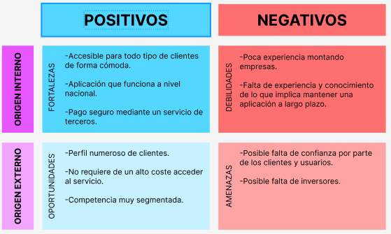
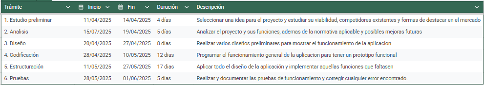
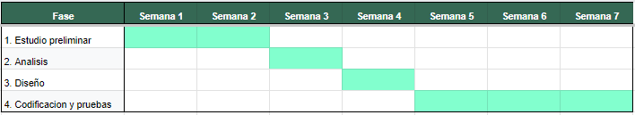

# Anteproxecto fin de ciclo

- [Anteproxecto fin de ciclo](#anteproxecto-fin-de-ciclo)
  - [1- Descrición do proxecto](#1--descrición-do-proxecto)
  - [2- Empresa](#2--empresa)
    - [2.1- Idea de negocio](#21--idea-de-negocio)
    - [2.2- Xustificación da idea](#22--xustificación-da-idea)
    - [2.3- Segmento de clientes](#23--segmento-de-clientes)
    - [2.4- Competencia](#24--competencia)
    - [2.5- Proposta de valor](#25--proposta-de-valor)
    - [2.6- Forma xurídica](#26--forma-xurídica)
    - [2.7- Investimentos](#27--investimentos)
      - [2.7.1- Custos](#271--custos)
      - [2.7.2- Ingresos](#272--ingresos)
    - [2.8- Viabilidade](#28--viabilidade)
      - [2.8.1- Viabilidade técnica](#281--viabilidade-técnica)
      - [2.8.2 - Viabilidade económica](#282---viabilidade-económica)
      - [2.8.3- Conclusión](#283--conclusión)
  - [3- Requirimentos técnicos](#3--requirimentos-técnicos)
  - [4- Planificación](#4--planificación)

## 1- Descrición do proxecto

**SABES LO QUE SIGNIFICA LA PALABRA BREVE??**

Este proyecto consiste en una plataforma web mediante la cual gestionar las citas y reservas de pequeños negocios locales.

Los usuarios pueden crear una cuenta y reservar cita desde ahi, pudiendo gestionarlas, reprogramarlas, recibir notificaciones respecto a su cita,...

Se mostrará una lista de los servicios que ofrece la empresa para que el usuario seleccione cual o cuales desea y ademas incluya cualquier informacion adicional.

Por parte de la empresa, esta puede consultar las citas que se han reservado y gestionarlas.

Para la realizacion del proyecto se combinaran varias tecnologias, como por ejemplo html, css, javascript y php, ademas de una base de datos relacional.

## 2- Empresa

> _EXPLICACIÓN_: Neste apartado desenvolveredes todo o referente os módulos de Empresa e iniciativa emprendedora e de FOL.

### 2.1- Idea de negocio

El producto central de mi negocio es una aplicación web mediante la cual los usuarios pueden acceder a una amplia variedad de cursos de forma sencilla, cubriendo su necesidad de formación en aquellos temas que les interesan y mediante la cual los clientes pueden promocionar sus cursos, facilitando el alcance de estos a un amplio público.

El valor añadido de esta idea se basa en que fomenta aquellos cursos realizados por organizaciones mas pequeñas o particulares, los cuales suelen tener menor alcance y por tanto no llegan a todos los posibles interesados. Respecto al usuario, el valor añadido respecto a la competencia es que encontrará una variedad mas amplia de cursos que pueden ajustarse a sus expectativas.

Su utilidad radica en facilitar el acceso a la formación a cualquier posible interesado de una manera sencilla e intuitiva, pudiendo acceder a aquellos cursos que por ser impartidos por organizaciones mas pequeñas suelen contar con menos recursos para publicitarlos y una gestión de la matrícula mas tediosa.

Como productos adicionales se incluyen el empleo de una aplicación externa de pago para mayor seguridad y un sistema de gestión de los cursos donde se encuentra matriculado el usuario actualmente.

### 2.2- Xustificación da idea

Esta idea surge de la necesidad de tener una amplia formación en el mercado laboral actual. Existen muchos interesados en seguir formandose que por la dificultad de acceso a una formación adecuada no logran adquirir todas las competencias que desean. Segun el INE, en 2022 el 50,6% de la población de 18 a 69 años realizó alguna actividad formativa, de los cuales el 43,6% participaron en educación no formal, predominando aquellos cuya edad comprendia de los 18 a los 34 años. Ademas, un 54,6% adquirieron conocimientos mediante apredizaje informal. 
Por otro lado existen cursos que por falta de medios no alcanzan a todos los posibles candidatos interesados en esa formación. 

Para cubrir estas necesidades, se busca establecer una plataforma que recoja la mayor cantidad posible de estos cursos y los ponga a la disposición de cualquier posible interesado de una forma sencilla y eficiente.

Actualmente existe plataformas similares a esta,como Udemy o Codigo Facilito, que ofertan diversos cursos. Pero estas plataformas suelen centrarse en una rama específica o ofertar solamente sus propios cursos. Ademas, en la mayoria de casos la formación que ofertan suele ser fundamentalmente a distancia.

En cambio, esta aplicación busca aunar todos estos cursos en un solo lugar y ofertar tanto cursos presenciales como telemáticos. Así, se atiende ese segmento del mercado que no esta lo suficientemente atendido, el de las personas que buscan cursos presenciales, ya sea por comodidad o por que consideran que este tipo de formación resulta más eficaz.

Pese a no ser un producto completamente nuevo, es cierto que el mercado actual es ineficiente debido a la dificultad que tienen los usuarios para encontrar con facilidad los cursos que desean ante tanta oferta disponible que se encuentra dispersa. Ademas, tambien atiende por parte del cliente la necesidad de mayor promoción que tienen aquellas entidades mas pequeñas y particulares, a las cuales les cuesta competir ante las grandes organizaciones.

#### DAFO

### 2.3- Segmento de clientes

Este negocio diferencia entre usuarios y clientes:

> - Por parte de los usuarios va dirigido fundamentalmente a jovenes (de entre 16 y 30 años) que deseen formarse en alguna materia concreta o ampliar sus conocimientos, ya sea para mejorar profesionalmente o por gusto. Segun el INE, en 2022 habia en España aproximadamente 7 millones y medio de jovenes comprendidos en este rango de edades. Si asumimos que aproximadamente 1 de cada 5 se interesa por la formación mas alla de las instituciones convencionales, nos da 1 millon y medio de posibles interesados, ademas de aquellos posibles interesados fuera de este rango de edad.

> - Por parte de los clientes va dirigido a aquellas organizaciones mas pequeñas cuyos cursos no tengan el alcance deseado, y tambien a aquellos particulares que deseen compartir su conocimiento y experiencia profesional en cualquier materia. En 2024 España tenía en activo 21 millones y medio de profesionales en activo, entre los cuales podría haber una gran cantidad de interesados en compartir sus enseñanzas y vivencias adquiridas durante su vida laboral.

### 2.4- Competencia

> _EXPLICACIÓN_: Neste apartado deberase indicar que outras empresas operan no mercado. Que cota de mercado teñen e como están posicionadas. Existencia de productos/servizos substitutivos. Como están posicionados.

### 2.5- Proposta de valor

> _EXPLICACIÓN_: **Apartado fundamental.**
>
> - En que se diferencia fronte os competidores.
> - Que melloras terá fronte os competidores.
> - Que valor aporta ao mercado.
> - ¿Porqué mercarán/contratarán este producto/servizo/idea fronte o resto?

### 2.6- Forma xurídica

> _EXPLICACIÓN_: Neste apartado deberedes indicar a forma xurídica: autónomo, soc. Cooperativa, SL,.. Explicando (nun par de frases) por que escolledes esta forma

### 2.7- Investimentos

> _EXPLICACIÓN_: Neste apartado idicaremos o investimentos, aínda que sexa, só unha enumeración de todo o que necesitan (locais, infraestruturas, equipos, suministros, mobiliario...) cuantificando cada elemento.

#### 2.7.1- Custos

> > _EXPLICACIÓN_: Neste apartado idicaremos o invertimento
>
> - Diferenzando custos fixos de variables.
> - Computando impostos e custos sociais.

#### 2.7.2- Ingresos

> _EXPLICACIÓN_: Neste apartado indicarase unha previsión de ventas e unha política de prezos. Isto implicar apuntar unha previsión de ventas e unha política de prezos.

### 2.8- Viabilidade

#### 2.8.1- Viabilidade técnica

> _EXPLICACIÓN_: Neste subapartado deberás defender tendo en conta os datos xa aportados, a viabilidade da realización do proyecto.
> Evidentemente, para poder xustificar a viabilidade económica do proyecto deberás ter en conta os ingresos. **Ainda que está na parte de empresa, este apartado é interesante dende o punto de vista técnico**
>
> - Será posible dispoñer dos recursos humanos e medios de produción necesarios (materias primas, maquinaria, instalacións, etc.)?
> - Existe algún impedimento técnico que dificulte o proceso produtivo?

#### 2.8.2 - Viabilidade económica

> _EXPLICACIÓN_: Neste subapartado deberás defender con datos a viabilidade da realización do proyecto, para elo debes indicar os custos e investimentos:

#### 2.8.3- Conclusión

> - É viable?
> - Os beneficios do proxecto son superiores aos costes?
> - As perdas poden cubrirse vía financiamento (por parte da administración pública, con subvencións, etc)?

## 3- Requirimentos técnicos

### Infraestructura

Para realizar la aplicación será necesario contar con una infraestructura compuesta por de:

- Un **servidor de bases de datos** que almacene la informacion referente a los usuarios y sus reservas.
- Un **dominio** para acceder facilmente a la aplicación. 
- Un **servidor web dedicado** donde alojar la aplicacion web para su puesta en producción.

### Backend

En cuanto a Backend se se utilizará **PHP**, ya sea con **Docker** o **Laravel**, junto a una base de datos, como por ejemplo **MariaDB**. 
Esta parte se encargará de:

- La gestion de los usuarios y clientes.
- Del proceso de matriculacion.
- De almacenar la información referente a los cursos y su creación.

### Frontend

En cuanto a Frontend se utilizará fundamentalmente **HTML**, **CSS** y **JavaScript** par:

- Gestionar el como se muestran los cursos.
- El acceso a la informacion de los mismos.
- La distribucion de la aplicación.

## 4- Planificación

**NO ES CALCAR LO QUE YO OS PONGO DE LAS FASES DE ENTREGA, ES LO QUE CREEIS TU Y LAS FASES QUE REALMENTE APLICARÍAS**

🔗 [Ver documento en Google Drive](https://docs.google.com/spreadsheets/d/1kpykDfHXtSo1yaPI2eACs158QWQv665RncFkcX2uEAA/edit?usp=sharing)

[**<-Anterior**](../../README.md)
